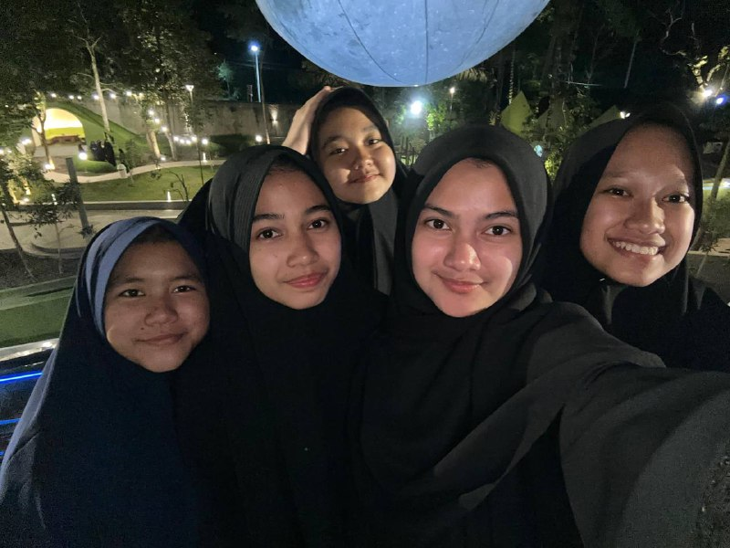
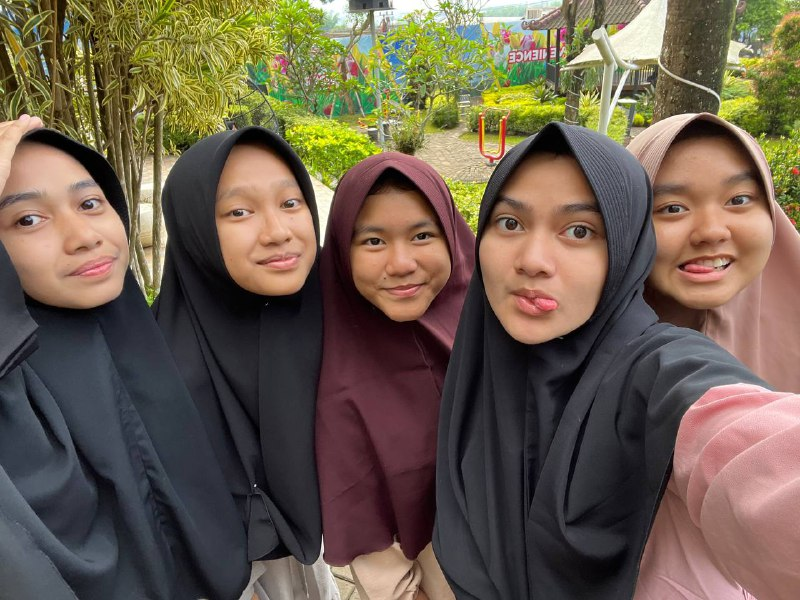
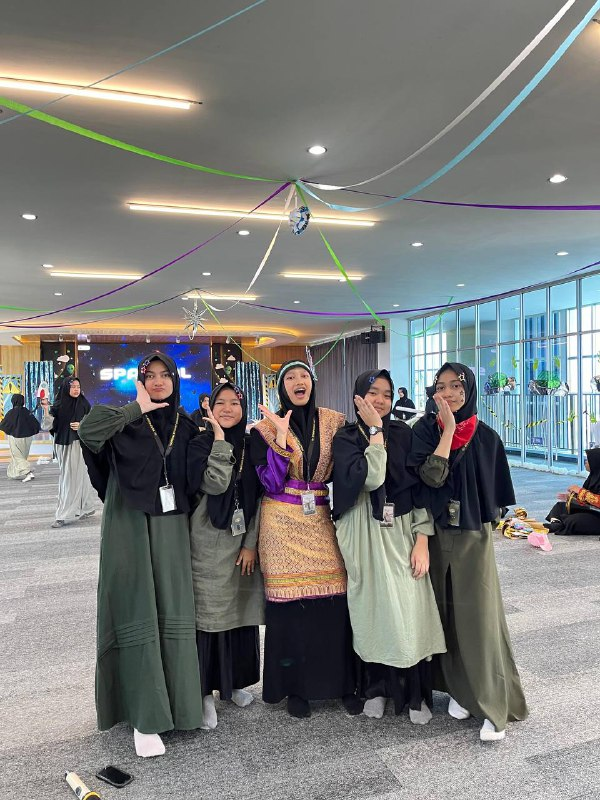
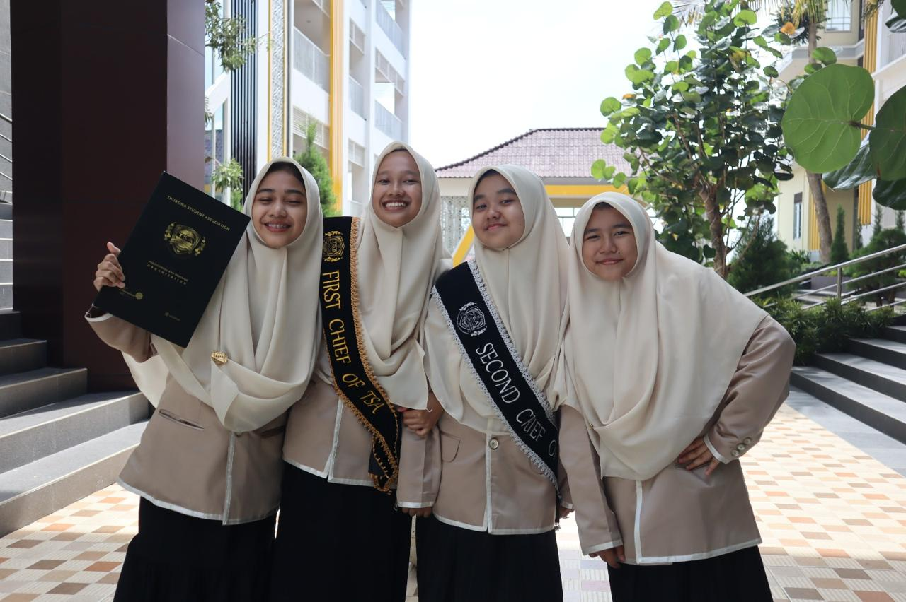
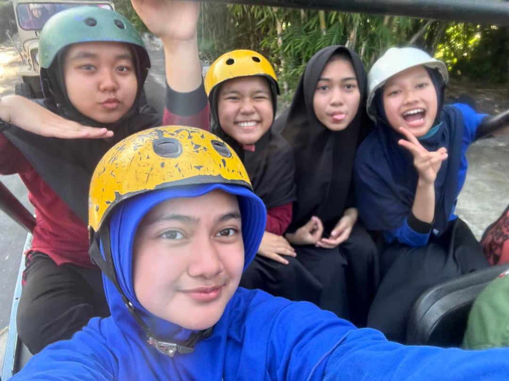
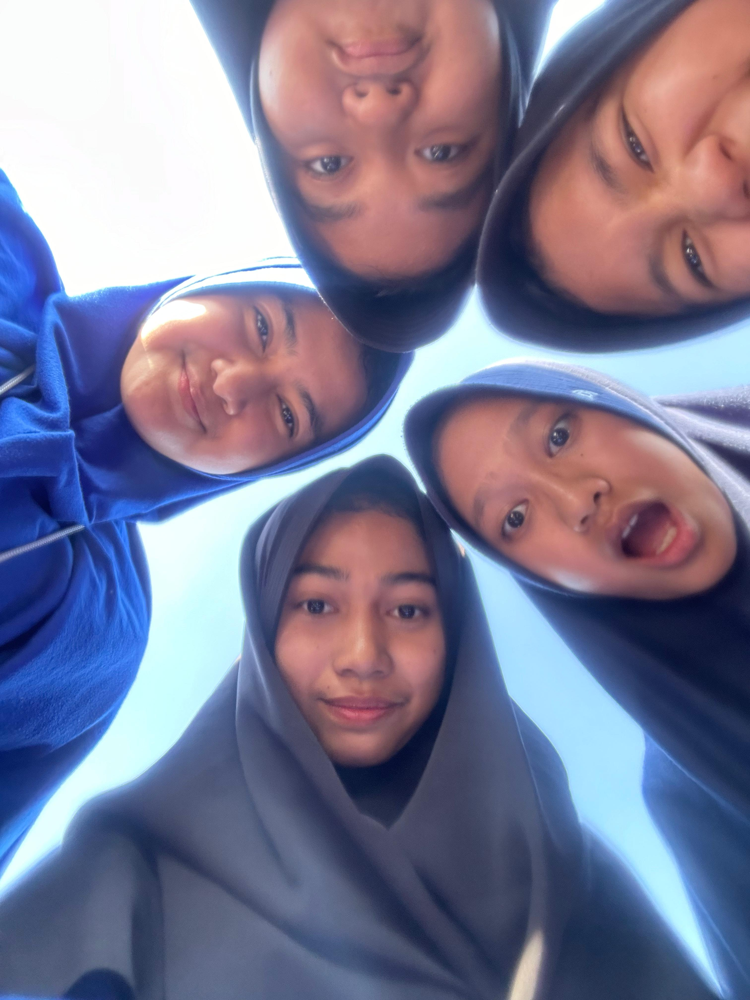

<!DOCTYPE html>
<html lang="en">
<head>
  <meta charset="UTF-8" />
  <meta name="viewport" content="width=device-width, initial-scale=1.0" />
  <title>Video di Tengah</title>
  <link href="https://fonts.googleapis.com/css2?family=Poppins:wght@400;600&display=swap" rel="stylesheet">
  
  
</head>
<body>
  <h1>Enjoy Your New Journey!!</h1>
  

    <video controls>
      <source src="video.mp4" type="video/mp4">
      Browsermu tidak mendukung tag video.
    </video>
  

  <button class="music-button" onclick="toggleMusic()">Play Music 🎵</button>

  

    

      
      
LDK NIH BOS😁

    

    

      
      
Yalili mode versi ber 5

    

    

      
      
seru bgt, sampe pengen nonjok

    

    

      
      
canggung + polos😆

    

    

        
        
ciailah after dauroh😋

    

    

        
        
udah ga canggung nich😆

    

    

        
        
HORE SPARVAL🧟

    

    

        
        
mencari sponsor, berujung?

    

    

        
        
kak nilna sakit

    

    

        
        
bocah petualang

    

    

        
        
hah? ada apatuh!

    

    

        
        
allhamdulillah lengser

    

    

        
        
ka nilna marah fotonya cmn ber4

    

    

        
        
semakin bahagia

    

    

        
        
pose andalan bos

    

    

        
        
KUAT! KUAT!KUAT

      

  

  <audio id="bg-music" loop>
    <source src="butterflies.mp3" type="audio/mp3">
    Browsermu tidak mendukung tag audio.
  </audio>

  
</body>
</html>
